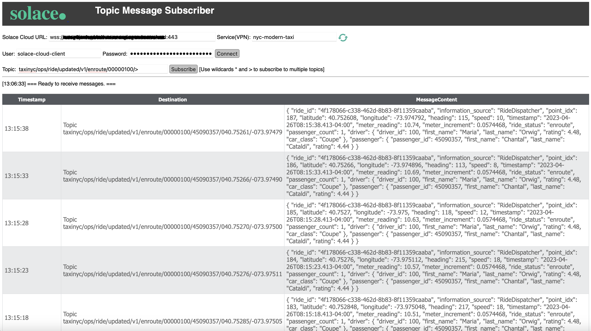

# Solace Message Viewer 

This tool can be used to receive and display text messages from Solace PubSub+ message brokers.

The following receivers are supported:

* Topic Subscriber
* Queue Browser

You can preconfigure the broker connection details in the SolBrokerConfig.js file, multiple broker configurations are supported.

Note the receiver will automatically terminate after receiving 1000 messages.

Example screenshot:

